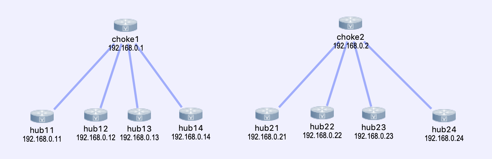

# genie-neighbor-check

In various network topologies, a given device can have several "important" adjacencies.

Some sample scenarios:
* an aggregation router should be adjacencies with core routers
* leaves should have adjacencies with all spines
* a branch location should have an adjacency with both data centers

This project shows a sample of how we can accomplish this with pyATS and Genie.

## Sample topology



## Testing Approach


## Configuration

To customize your installation
## Getting Started

To make things easier, the entire solution is described in [docker-compose.yaml](./docker-compose.yaml)

To launch
```
docker-compose build && docker-compose up
```


## Portainer

To make getting the logs / consoles much easier - you should take a look at [portainer](https://github.com/portainer/portainer)

The UI should be available at http://docker_host:9000/ make sure your firewall rules
allow this communication
